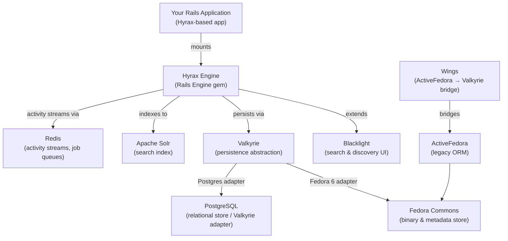

Hyrax is a [Ruby on Rails Engine](https://guides.rubyonrails.org/engines.html) built by the [Samvera community](https://samvera.org). It provides a feature-rich foundation for creating digital repository applications — giving you work types, configurable deposit workflows, flexible metadata, IIIF support, collections, and an administrative dashboard without building any of it from scratch. Because Hyrax is an engine rather than a standalone application, you mount it inside your own Rails application and customize it to fit your institution's requirements. The application that mounts Hyrax is called a "Hyrax-based application."

<Note>
  Hyrax is not a web application you run directly. To build your digital repository you must create a Rails application and mount the Hyrax engine inside it. The [quickstart](/quickstart) template command handles this for you automatically.
</Note>

## The Samvera community

Hyrax is maintained by [Samvera](https://samvera.org), an open-source community of memory institutions — including universities, libraries, museums, and archives — that collaborate to build repository infrastructure. The community maintains Hyrax under the Apache 2.0 license and provides support through the [Samvera community Slack](https://samvera.atlassian.net/wiki/spaces/samvera/pages/405211682/Getting+Started+in+the+Samvera+Community#Join-the-Samvera-Slack-workspace) (`#dev` channel) and the [Samvera tech mailing list](https://samvera.atlassian.net/wiki/spaces/samvera/pages/1171226735/Samvera+Community+Email+Lists). The [Hyrax Maintenance Working Group](https://samvera.atlassian.net/wiki/spaces/samvera/pages/496632295/Hyrax+Maintenance+Working+Group) steers the project, including a Product Owner and Tech Lead.

## What Hyrax provides

Hyrax bundles the core capabilities expected of a modern digital repository platform:

<AccordionGroup>
  <Accordion title="Work types">
    Generate repository object types on demand using Rails generators. Each work type gets its own model, presenter, form, indexer, and controller. Pass a CamelCased model name to get started:

    ```bash
    rails generate hyrax:work_resource GenericWork
    ```

    Work types can be namespaced and customized after generation. Starting with Hyrax v5, generated work types use [Valkyrie](https://github.com/samvera/valkyrie) for persistence rather than ActiveFedora.
  </Accordion>
  <Accordion title="Deposit workflows">
    Route submitted content through configurable, multi-step approval workflows. Workflows are powered by [Sipity](https://github.com/samvera/sipity) and support multiple reviewers, workflow states, and email notifications. Default workflows are loaded automatically when you run `rails db:seed`.
  </Accordion>
  <Accordion title="Flexible metadata">
    Define metadata schemas in YAML files or via the M3 (Metadata Model Maker) profile interface without modifying Ruby source code. Hyrax uses [questioning_authority (QA)](https://github.com/samvera/questioning_authority) to supply controlled vocabularies and linked data lookups via RDF.
  </Accordion>
  <Accordion title="IIIF support">
    Hyrax generates [IIIF](https://iiif.io/) manifests for works with image content using the `iiif_manifest` gem. It ships with an [OpenSeadragon](https://openseadragon.github.io/) viewer out of the box and can be configured to use any IIIF-compatible viewer.
  </Accordion>
  <Accordion title="Collections">
    Organize works into collections with granular access controls. Hyrax supports typed collections — including user collections and admin sets — through a collection type system configurable from the administrative dashboard. Collections can be nested and shared across users.
  </Accordion>
  <Accordion title="Administrative dashboard">
    Toggle optional features on or off from a built-in admin UI powered by [Flipflop](https://github.com/voormedia/flipflop). The dashboard also provides workflow management, user and role administration, analytics (Google Analytics integration via the `google-analytics-data` gem), and collection type configuration.
  </Accordion>
  <Accordion title="Background jobs">
    Resource-intensive tasks — file ingest, derivative generation, characterization, fixity checking, Solr indexing — run asynchronously via the Rails [ActiveJob](https://guides.rubyonrails.org/active_job_basics.html) framework. You can use any queue backend ActiveJob supports; production deployments typically use [Sidekiq](https://sidekiq.org/).
  </Accordion>
  <Accordion title="Valkyrie persistence">
    Starting with Hyrax v5, the framework uses [Valkyrie](https://github.com/samvera/valkyrie) as its persistence layer. Valkyrie provides an adapter-based interface that allows you to store repository objects in PostgreSQL, Fedora 6, or other storage backends interchangeably. The legacy [Wings](https://github.com/samvera/hyrax/tree/main/lib/wings) compatibility layer allows gradual migration from ActiveFedora.
  </Accordion>
</AccordionGroup>

## Architecture overview

Understanding how Hyrax's components relate to one another helps when designing, extending, and troubleshooting a Hyrax-based application.



**Hyrax** is the Rails Engine at the center. It extends **Blacklight** to add repository-specific search and faceting, and delegates persistence to **Valkyrie**. Valkyrie's adapter model means you can store repository objects in **Fedora 6**, **PostgreSQL**, or both simultaneously. The **Wings** adapter provides backward compatibility for applications that previously relied on **ActiveFedora** with **Fedora 4/5**. All discovery queries flow through **Apache Solr**, and **Redis** underpins activity streams and (when using Sidekiq) the background job queue.

## Who should use Hyrax

Hyrax is designed for digital library and repository teams at universities, archives, museums, and other cultural heritage institutions that need to:

- Ingest, describe, and provide access to digital objects (images, audio, video, documents, datasets)
- Support complex deposit and review workflows with multiple approvers
- Expose content via IIIF for interoperability with other platforms
- Manage granular access controls for restricted or embargoed content
- Operate under institutional IT constraints that favor established, well-supported open-source software

Hyrax is a Ruby on Rails application and requires a team comfortable with Ruby, Rails, and the supporting service stack (Solr, PostgreSQL or Fedora, Redis). It is not a hosted SaaS product — you install, configure, and operate it yourself, or with a hosting partner familiar with the Samvera ecosystem.

## Next steps

<CardGroup cols={2}>
  <Card title="Quickstart" icon="rocket" href="/quickstart">
    Generate a new Hyrax-based application and get it running in minutes using the Rails template and Lando.
  </Card>
  <Card title="Installation" icon="wrench" href="/installation">
    Detailed instructions for every prerequisite: Ruby, Solr, Fedora, PostgreSQL, Redis, ImageMagick, FITS, LibreOffice, and ffmpeg.
  </Card>
  <Card title="Works and file sets" icon="file-lines" href="/concepts/works-and-filesets">
    Understand the core repository object model: works, file sets, and the relationship between them.
  </Card>
  <Card title="Deposit workflows" icon="arrows-spin" href="/concepts/workflows">
    Learn how Sipity-based workflows control the review and approval of submitted content.
  </Card>
</CardGroup>
